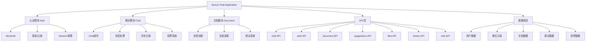

### 1. 实时聊天功能

````mermaid
sequenceDiagram
    participant User as 用户
    participant UI as 前端界面
    participant API as Chat API
    participant AI as AI 服务
    participant DB as 数据库

    User->>UI: 输入消息
    
    Note over UI: 前端处理
    UI->>UI: 1. 验证消息
    UI->>UI: 2. 显示发送状态
    UI->>UI: 3. 本地状态更新

    UI->>API: POST /api/chat
    
    Note over API: 后端处理
    API->>DB: 1. 获取历史上下文
    API->>API: 2. 构建 Prompt
    API->>AI: 3. 发送请求

    Note over AI: 流式响应
    AI-->>API: 开始流式返回
    API-->>UI: 转发流式数据
    
    loop 实时更新
        UI->>UI: 更新聊天界面
    end

    Note over API: 数据持久化
    API->>DB: 保存对话记录
````


关键代码:
```typescript
// app/(chat)/api/chat/route.ts
export async function POST(request: Request) {
  // 1. 获取消息内容
  const { id, messages, modelId } = await request.json();
  
  // 2. 验证用户身份
  const session = await auth();
  
  // 3. 处理聊天
  const result = await streamText({
    model: customModel(model.apiIdentifier),
    messages: coreMessages,
    // 4. 流式响应处理
    onFinish: async ({ responseMessages }) => {
      await saveMessages({...})
    }
  });
}
```


### 2. 文档管理系统

````mermaid
graph TD
    A[文档管理] --> B[创建文档]
    A --> C[更新文档]
    A --> D[文档建议]
    A --> E[版本控制]

    B --> B1[AI生成内容]
    B --> B2[保存文档]
    B --> B3[实时预览]

    C --> C1[增量更新]
    C --> C2[历史记录]
    C --> C3[协同编辑]

    D --> D1[AI分析]
    D --> D2[建议生成]
    D --> D3[建议应用]

    E --> E1[版本追踪]
    E --> E2[回滚功能]
    E --> E3[差异比较]
````

关键代码:
```typescript
// app/(chat)/api/document/route.ts
export async function POST(request: Request) {
  // 1. 创建文档
  const { content, title } = await request.json();
  
  // 2. 保存文档
  const document = await saveDocument({
    id,
    content,
    title,
    userId: session.user.id,
  });
}

// 文档更新
export async function PATCH(request: Request) {
  // 1. 版本控制
  const { timestamp } = await request.json();
  
  // 2. 更新文档
  await deleteDocumentsByIdAfterTimestamp({
    id,
    timestamp: new Date(timestamp),
  });
}
```


### 3. 流式响应处理

````mermaid
sequenceDiagram
    participant Client as 客户端
    participant Server as 服务器
    participant AI as AI服务
    participant Stream as 流处理器

    Client->>Server: 发送请求
    Server->>AI: 调用AI服务
    
    activate Stream
    AI-->>Stream: 开始流式响应
    
    loop 流式数据处理
        Stream->>Stream: 处理数据块
        Stream-->>Client: 发送数据块
        Client->>Client: 更新UI
    end
    
    Stream-->>Server: 完成响应
    deactivate Stream
    
    Server->>Server: 保存完整记录
````

关键代码:
```typescript
// 流式响应处理
const streamingData = new StreamData();

const result = await streamText({
  model: customModel(model.apiIdentifier),
  messages: coreMessages,
  onFinish: async ({ responseMessages }) => {
    // 处理完成回调
    await saveMessages({
      messages: responseMessages.map(message => ({
        id: generateUUID(),
        chatId: id,
        role: message.role,
        content: message.content,
        createdAt: new Date()
      }))
    });
    
    streamingData.close();
  }
});

// 前端处理流式数据
const response = await fetch('/api/chat', {
  method: 'POST',
  body: JSON.stringify({ message })
});

const reader = response.body?.getReader();
while (true) {
  const { done, value } = await reader?.read();
  if (done) break;
  // 更新UI显示
  updateUI(value);
}
```