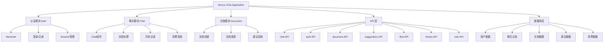
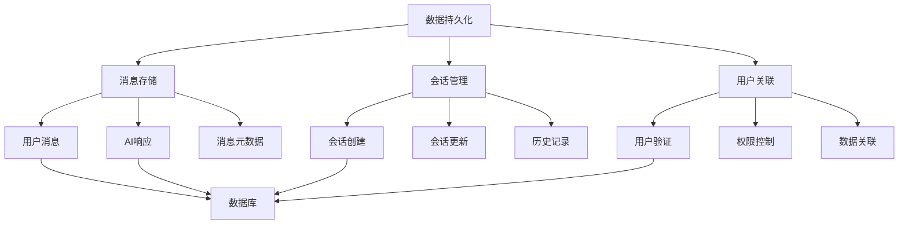
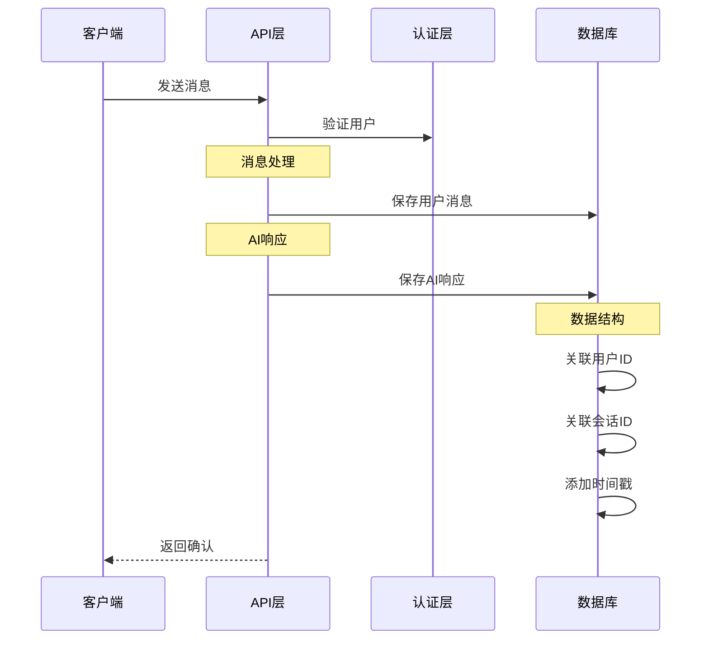
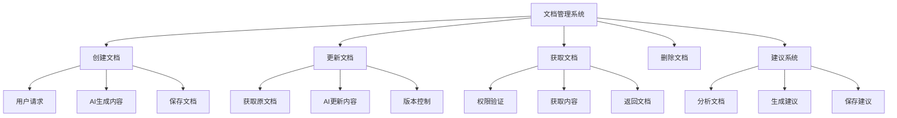
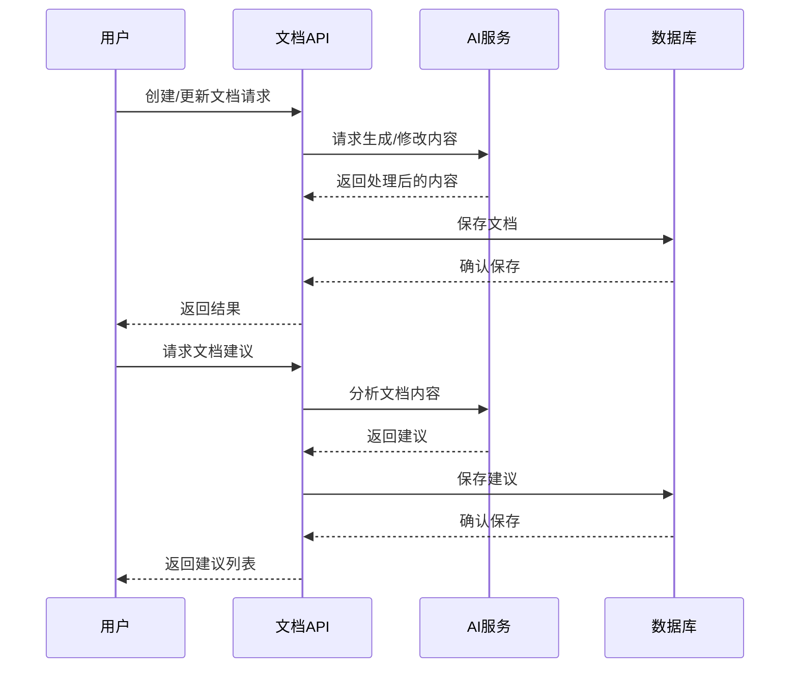

### 1. 实时聊天功能

````mermaid
sequenceDiagram
    participant User as 用户
    participant UI as 前端界面
    participant API as Chat API
    participant AI as AI 服务
    participant DB as 数据库

    User->>UI: 输入消息
    
    Note over UI: 前端处理
    UI->>UI: 1. 验证消息
    UI->>UI: 2. 显示发送状态
    UI->>UI: 3. 本地状态更新

    UI->>API: POST /api/chat
    
    Note over API: 后端处理
    API->>DB: 1. 获取历史上下文
    API->>API: 2. 构建 Prompt
    API->>AI: 3. 发送请求

    Note over AI: 流式响应
    AI-->>API: 开始流式返回
    API-->>UI: 转发流式数据
    
    loop 实时更新
        UI->>UI: 更新聊天界面
    end

    Note over API: 数据持久化
    API->>DB: 保存对话记录
````


关键代码:
```typescript
// app/(chat)/api/chat/route.ts
export async function POST(request: Request) {
  // 1. 获取消息内容
  const { id, messages, modelId } = await request.json();
  
  // 2. 验证用户身份
  const session = await auth();
  
  // 3. 处理聊天
  const result = await streamText({
    model: customModel(model.apiIdentifier),
    messages: coreMessages,
    // 4. 流式响应处理
    onFinish: async ({ responseMessages }) => {
      await saveMessages({...})
    }
  });
}
```


### 数据持久化架构



### 数据流程





### 核心代码解析：


1. **数据库Schema**

```typescript
// lib/db/schema.ts
export const messages = pgTable('messages', {
  id: text('id').primaryKey(),
  chatId: text('chat_id').notNull(),
  role: text('role').notNull(),
  content: text('content').notNull(),
  createdAt: timestamp('created_at').notNull(),
  userId: text('user_id').notNull(),
});

export const chats = pgTable('chats', {
  id: text('id').primaryKey(),
  title: text('title').notNull(),
  userId: text('user_id').notNull(),
  createdAt: timestamp('created_at').notNull(),
});
```


2. **消息保存逻辑**
```typescript
// lib/db/queries.ts
export async function saveMessages({
  messages,
}: {
  messages: Array<{
    id: string;
    chatId: string;
    role: string;
    content: string;
    createdAt: Date;
  }>;
}) {
  return db.insert(schema.messages).values(messages);
}

export async function saveChat({
  id,
  userId,
  title,
}: {
  id: string;
  userId: string;
  title: string;
}) {
  return db.insert(schema.chats).values({
    id,
    userId,
    title,
    createdAt: new Date(),
  });
}
```

3. **API层实现**
```typescript
// app/(chat)/api/chat/route.ts
export async function POST(request: Request) {
  const { id, messages } = await request.json();
  const session = await auth();

  // 验证用户
  if (!session?.user?.id) {
    return new Response('Unauthorized', { status: 401 });
  }

  // 保存用户消息
  await saveMessages({
    messages: [{
      id: generateUUID(),
      chatId: id,
      role: 'user',
      content: messages[messages.length - 1].content,
      createdAt: new Date()
    }]
  });

  // AI响应处理
  const result = await streamText({
    // ... AI 配置
    onFinish: async ({ responseMessages }) => {
      // 保存AI响应
      await saveMessages({
        messages: responseMessages.map(message => ({
          id: generateUUID(),
          chatId: id,
          role: message.role,
          content: message.content,
          createdAt: new Date()
        }))
      });
    }
  });
}
```


4. **历史记录查询**
```typescript
// lib/db/queries.ts
export async function getMessagesByChatId({
  id,
}: {
  id: string;
}) {
  return db
    .select()
    .from(schema.messages)
    .where(eq(schema.messages.chatId, id))
    .orderBy(asc(schema.messages.createdAt));
}

export async function getChatsByUserId({
  id,
}: {
  id: string;
}) {
  return db
    .select()
    .from(schema.chats)
    .where(eq(schema.chats.userId, id))
    .orderBy(desc(schema.chats.createdAt));
}
```


数据持久化的关键特点：
1. 数据完整性
  每条消息都有唯一ID
  关联到特定会话和用户
  包含时间戳信息
  区分消息角色（用户/AI）
2. 事务处理
  消息保存的原子性
  错误处理和回滚
  数据一致性保证
3. 查询优化
  索引设计
  按时间排序
  按会话分组
4. 安全性
  用户认证
  数据访问控制
  数据隔离
5. 性能考虑
  批量插入
  异步处理
  缓存策略


### 2. 文档管理系统

````mermaid
graph TD
    A[文档管理] --> B[创建文档]
    A --> C[更新文档]
    A --> D[文档建议]
    A --> E[版本控制]

    B --> B1[AI生成内容]
    B --> B2[保存文档]
    B --> B3[实时预览]

    C --> C1[增量更新]
    C --> C2[历史记录]
    C --> C3[协同编辑]

    D --> D1[AI分析]
    D --> D2[建议生成]
    D --> D3[建议应用]

    E --> E1[版本追踪]
    E --> E2[回滚功能]
    E --> E3[差异比较]
````

关键代码:
```typescript
// app/(chat)/api/document/route.ts
export async function POST(request: Request) {
  // 1. 创建文档
  const { content, title } = await request.json();
  
  // 2. 保存文档
  const document = await saveDocument({
    id,
    content,
    title,
    userId: session.user.id,
  });
}

// 文档更新
export async function PATCH(request: Request) {
  // 1. 版本控制
  const { timestamp } = await request.json();
  
  // 2. 更新文档
  await deleteDocumentsByIdAfterTimestamp({
    id,
    timestamp: new Date(timestamp),
  });
}
```


让我帮你梳理文档管理系统的相关代码：


1. **文档 API 路由**
```typescript
// app/(chat)/api/document/route.ts
export async function GET(request: Request) {
  // 获取文档
  const { searchParams } = new URL(request.url);
  const id = searchParams.get('id');
  const documents = await getDocumentsById({ id });
}

export async function POST(request: Request) {
  // 创建文档
  const { content, title } = await request.json();
  const document = await saveDocument({
    id,
    content,
    title,
    userId: session.user.id,
  });
}

export async function PATCH(request: Request) {
  // 更新文档
  const { timestamp } = await request.json();
  await deleteDocumentsByIdAfterTimestamp({
    id,
    timestamp: new Date(timestamp),
  });
}
```


2. **文档建议系统**
```typescript
// app/(chat)/api/suggestions/route.ts
export async function GET(request: Request) {
  const { searchParams } = new URL(request.url);
  const documentId = searchParams.get('documentId');
  
  const suggestions = await getSuggestionsByDocumentId({
    documentId,
  });
}
```


3. **AI 文档生成工具**
```typescript
// app/(chat)/api/chat/route.ts 中的相关工具
tools: {
  createDocument: {
    description: 'Create a document for a writing activity',
    parameters: z.object({
      title: z.string(),
    }),
    execute: async ({ title }) => {
      const id = generateUUID();
      let draftText = '';

      // 流式生成文档内容
      const { fullStream } = await streamText({
        model: customModel(model.apiIdentifier),
        system: 'Write about the given topic...',
        prompt: title,
      });

      // 保存文档
      await saveDocument({
        id,
        title,
        content: draftText,
        userId: session.user.id,
      });
    }
  },
  updateDocument: {
    description: 'Update a document with the given description',
    parameters: z.object({
      id: z.string(),
      description: z.string(),
    }),
    execute: async ({ id, description }) => {
      // 获取现有文档
      const document = await getDocumentById({ id });
      
      // 更新文档内容
      const { fullStream } = await streamText({
        model: customModel(model.apiIdentifier),
        system: 'You are a helpful writing assistant...',
        messages: [
          { role: 'user', content: description },
          { role: 'user', content: currentContent }
        ],
      });
    }
  }
}
```


4. **数据库查询**
```typescript
// lib/db/queries.ts
export async function getDocumentById({
  id,
}: {
  id: string;
}) {
  return db
    .select()
    .from(schema.documents)
    .where(eq(schema.documents.id, id));
}

export async function saveDocument({
  id,
  content,
  title,
  userId,
}: {
  id: string;
  content: string;
  title: string;
  userId: string;
}) {
  return db.insert(schema.documents).values({
    id,
    content,
    title,
    userId,
    createdAt: new Date(),
  });
}

export async function deleteDocumentsByIdAfterTimestamp({
  id,
  timestamp,
}: {
  id: string;
  timestamp: Date;
}) {
  return db
    .delete(schema.documents)
    .where(
      and(
        eq(schema.documents.id, id),
        gt(schema.documents.createdAt, timestamp),
      ),
    );
}
```


文档管理系统的主要功能流程：



文档操作的数据流：




### 3. 流式响应处理

````mermaid
sequenceDiagram
    participant Client as 客户端
    participant Server as 服务器
    participant AI as AI服务
    participant Stream as 流处理器

    Client->>Server: 发送请求
    Server->>AI: 调用AI服务
    
    activate Stream
    AI-->>Stream: 开始流式响应
    
    loop 流式数据处理
        Stream->>Stream: 处理数据块
        Stream-->>Client: 发送数据块
        Client->>Client: 更新UI
    end
    
    Stream-->>Server: 完成响应
    deactivate Stream
    
    Server->>Server: 保存完整记录
````

关键代码:
```typescript
// 流式响应处理
const streamingData = new StreamData();

const result = await streamText({
  model: customModel(model.apiIdentifier),
  messages: coreMessages,
  onFinish: async ({ responseMessages }) => {
    // 处理完成回调
    await saveMessages({
      messages: responseMessages.map(message => ({
        id: generateUUID(),
        chatId: id,
        role: message.role,
        content: message.content,
        createdAt: new Date()
      }))
    });
    
    streamingData.close();
  }
});

// 前端处理流式数据
const response = await fetch('/api/chat', {
  method: 'POST',
  body: JSON.stringify({ message })
});

const reader = response.body?.getReader();
while (true) {
  const { done, value } = await reader?.read();
  if (done) break;
  // 更新UI显示
  updateUI(value);
}
```